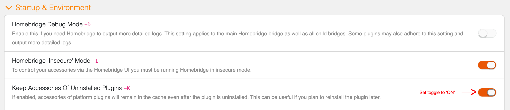

<div>
    <a href="https://www.npmjs.com/package/homebridge-virtual-accessories"></a>
    <a href="https://www.npmjs.com/package/homebridge-virtual-accessories"></a>
    <!-- a href="https://github.com/homebridge/homebridge"></a -->
    <a href="https://github.com/homebridge/homebridge/wiki/Verified-Plugins"></a>
    <a href="https://github.com/justjam2013/homebridge-virtual-accessories"></a>
    <a href="https://discord.gg/Z8jmyvb"></a>
</div>

<br/><br/>
<p align="center" vertical-align="middle">
    <a href="https://github.com/justjam2013/homebridge-virtual-accessories"></a>
    <a href="https://github.com/homebridge/homebridge"></a>
</p>

<span align="center">

# Virtual Accessories For Homebridge

</span>

### Virtual Accessories For Homebridge is a plugin for Homebridge that provides the ability to create virtual HomeKit accessories.

This plugin is inspired by Nick Farina's most excellent 🎸 [homebridge-dummy](https://github.com/nfarina/homebridge-dummy) plugin, which formed the backbone of my HomeKit automations.

The purpose of this plugin is to provide a single solution for creating different types of virtual HomeKit accessories, instead of having to pull together a large number of plugins, each of which may provide part of the needed functionality, and many of which may be unmaintained or abandoned. This plugin implements the latest Homebridge architecture and is ready for Homebridge 2.0.

The downside to a single plugin is trading ease of maintenance of installed plugins for a single point of failure. However, this is work in progress so ongoing bug fixes will be published. Also, I will slowly be adding new accessories and functionality, either as I need them, or, more likely, in response to requests by users who find this plugin useful.

The current virtual accessories provided are:

-   **Switch.** Nobody can have too many switches! Allows you to create plain old switches, normally on/off switches, stateful switches, switches with fixed or random timers, and switches with companion sensors to trigger HomeKit notifications.
-   **Doorbell.** Allows you to use any button as a doorbell and have it play a chime on Homepods.
-   **Garage Door.** Will display a widget in CarPlay when you approach your home. Generates a HomeKit notification when the accessory's state changes.
-   **Lock.** This was just low hanging fruit. Generates a HomeKit notification when the accessory's state changes. It also creates a Home Key card in the Wallet app.
-   **Window Covering.** These are blinds and shades. This was created for a user that wanted to use "Siri open/close .." to control their automation, as opposed to "Siri on/off .." as would be required with switches.
-   **Valve** - Allows you to create different types of valves: generic, irrigation, shower head, or water faucet.
-   **Sensor.** Allows you to create different types of sensors. If configured in the Home app, sensors will generate notifications when their state changes in response to a detected event. Some types of notifications, classified as `critical` by Homekit, are allowed to bypass `Do Not Disturb` and some are allowed to appear in CarPlay. Sensors can be activated by different triggers. Currently, the options are:
    - **Host Ping trigger.** Pings a network host. It is actvated after 3 failed ping attempts. The sensor resets when ping is successful.
    - **Cron trigger.** Activates the sensor when the time and date match the schedule deascribed by the cron expression. The sensor resets after a brief delay.
    - **Switch trigger.** To trigger a sensor from a switch, create a switch with a companion sensor. A future release may provide the ability to create this pairing as a sensor with a switch as trigger.

## Installation

You can install this plugin via the Homebridge UI or from the command line, by typing:

```
npm install -g homebridge-virtual-accessories
```
**Note:** Virtual Accessories For Homebridge has dependencies on platform-native libraries, which get compiled for that particular platform at install time. Therefore you will need to make sure that the platform you are installing this plugin on has the necessary build tools available. The official Homebridge Docker image provides all the necessary tools out of the box. If you are choosing to install on other platforms, you will require the necessary technical skills to do the necessary installs. I have neither the capacity nor the hardware to test installs on every platform that Homebridge runs on, but I will try my best to help you get the plugin working. Below are platform specific installation notes, which I will try to update as users of this plugin report issues.

**Note:** If you mamually update the Node.js version that Homebridge is running on, you will need to ensure that the platform-native library `raw-socket` will also be updated. Run the following commands immediately after the Node.js update:
```
npm uninstall raw-socket
npm install raw-socket
```
**Note:** Due to Virtual Accessories For Homebridge using platform-native modules, when updating Node.js, if the `raw-socket` module is also not updated (see above), it may cause the plugin fail to load and Homebridge to delete all its accessories. It is therefore **strongly** recommended to toggle the `Keep Accessories Of Uninstalled Plugins` option to on. This setting is in the `Settings` screen, `Startup & Environment` section:



### Docker
If you are installing Virtual Accessories For Homebridge in the Homebridge Docker image, you will need to add the following lines to `config/startup.sh`:
```
npm uninstall raw-socket
npm install raw-socket
```
This will ensure that if the version of Node.js is updated in the Docker image, the platform-native library `raw-socket` will also be updated after the container starts up.

### MacOS
If you are installing Virtual Accessories For Homebridge in a Homebridge instance running on macOS, you will need to ensure that Xcode or the Xcode Command Line Tools are installed. To install Xcode or the Xcode Command Line Tools, use the following command:
```
xcode-select --install
```

### Synology
If you are installing Virtual Accessories For Homebridge in a Homebridge instance running on Synology DSM, you will need to ensure that a build toolchain is installed.

This document provides steps for installing the Entware toolchain and other needed packages: [DSM 7: Enable Compiling Of Native Modules](https://github.com/homebridge/homebridge-syno-spk/wiki/DSM-7:-Enable-Compiling-Of-Native-Modules).

The [Synology DSM 7.2.2 Developer Guide](https://help.synology.com/developer-guide/getting_started/system_requirement.html) provides information to setup the build tools for Synology DSM platforms.

## Configuration

You can configure the plugin from the Homebridge UI, or by ediiting the JSON configuration directly in the Homebridge JSON Config editor.
In the UI, required fields will be marked with an asterisk (*).

`accessoryID`, `accessoryName`, and `accessoryType` are required fields for all the accessories.

In the event that an accessory is misconfigured, you will see error entries in the logs to help you to correct the configuration. The log entries will look something like this:
```
[12/21/2024, 12:35:38 AM] [Virtual Accessories Platform] Skipping accessory. Configuration is invalid: { "accessoryID": "12345", "accessoryName": "My Switch", ... }
[12/21/2024, 12:35:38 AM] [Virtual Accessories Platform] Invalid fields: [switchDefaultState]
```

Note:
1. `accessoryID` uniquely identifies an accassory and each accessory must have a different value. If you do assign the same value by mistake, the plugin will skip any accessory that has a duplicate ID and output a message in the logs aterting you to correct the configuration. If you change the value of `accessoryID` after saving the config, Homebridge will handle the change as the accessory having been deleted and a new one created. This will cause the Home app to delete the "old" accessory, which in turn will delete any automations that use the deleted accessory, as well as any scenes that only use the deleted accessory.
2. `acccessoryName` is the name that will apppear on the Homekit tile for the accessory. While a unique name is not required, it is recommended to assign different names to each accessory.

### Doorbell

```json
{
    "name": "Virtual Accessories Platform",
    "devices": [
        {
            "accessoryID": "12345",
            "accessoryName": "My Doorbell",
            "accessoryType": "doorbell",
            "doorbellVolume": 100
        }
    ],
    "platform": "VirtualAccessoriesForHomebridge"
}
```

### Garage Door

```json
{
    "name": "Virtual Accessories Platform",
    "devices": [
        {
            "accessoryID": "12345",
            "accessoryName": "My Garage Door",
            "accessoryType": "garagedoor",
            "garageDoorDefaultState": "closed",
            "accessoryIsStateful": false
        }
    ],
    "platform": "VirtualAccessoriesForHomebridge"
}
```

### Lock

```json
{
    "name": "Virtual Accessories Platform",
    "devices": [
        {
            "accessoryID": "12345",
            "accessoryName": "My Lock",
            "accessoryType": "lock",
            "lockDefaultState": "unlocked",
            "accessoryIsStateful": false,
            "lockHardwareFinish": "tan"
        }
    ],
    "platform": "VirtualAccessoriesForHomebridge"
}
```
`lockHardwareFinish` sets the color of the HomeKey card in the Wallet app.

### Valve

```json
{
    "name": "Virtual Accessories Platform",
    "devices": [
        {
            "accessoryID": "7022976",
            "accessoryName": "Test Valve",
            "accessoryType": "valve",
            "valveType": "waterfaucet",
            "valveDuration": 0
        }
    ],
    "platform": "VirtualAccessoriesForHomebridge"
}
```

### Window Covering - Blinds, Shades

```json
{
    "name": "Virtual Accessories Platform",
    "devices": [
        {
            "accessoryID": "12345",
            "accessoryName": "My Blinds",
            "accessoryType": "windowcovering",
            "windowCoveringDefaultState": "closed",
            "accessoryIsStateful": false,
            "transitionDuration": 3
        }
    ],
    "platform": "VirtualAccessoriesForHomebridge"
}
```

### Switch

```json
{
    "name": "Virtual Accessories Platform",
    "devices": [
        {
            "accessoryID": "12345",
            "accessoryName": "My Switch",
            "accessoryType": "switch",
            "switchDefaultState": "off",
            "accessoryIsStateful": false
        }
    ],
    "platform": "VirtualAccessoriesForHomebridge"
}
```

### Switch with reset timer

```json
{
    "name": "Virtual Accessories Platform",
    "devices": [
        {
            "accessoryID": "12345",
            "accessoryName": "My Switch",
            "accessoryType": "switch",
            "switchDefaultState": "off",
            "accessoryIsStateful": false,
            "accessoryHasResetTimer": true,
            "resetTimer": {
                "duration": 10,
                "units": "seconds",
                "isResettable": true
            }
        }
    ],
    "platform": "VirtualAccessoriesForHomebridge"
}
```

### Switch with random reset timer

```json
{
    "name": "Virtual Accessories Platform",
    "devices": [
        {
            "accessoryID": "12345",
            "accessoryName": "My Switch",
            "accessoryType": "switch",
            "switchDefaultState": "off",
            "accessoryIsStateful": false,
            "accessoryHasResetTimer": true,
            "resetTimer": {
                "durationIsRandom": true,
                "durationRandomMin": 5,
                "durationRandomMax": 20,
                "units": "seconds",
                "isResettable": true
            }
        }
    ],
    "platform": "VirtualAccessoriesForHomebridge"
}
```

### Switch with companion sensor (sensor triggered on & off by switch state)

```json
{
    "name": "Virtual Accessories Platform",
    "devices": [
        {
            "accessoryID": "12345",
            "accessoryName": "My Switch",
            "accessoryType": "switch",
            "switchDefaultState": "off",
            "accessoryIsStateful": false,
            "accessoryHasCompanionSensor": true,
            "companionSensor": {
                "name": "My Companion Sensor",
                "type": "contact"
            }
        }
    ],
    "platform": "VirtualAccessoriesForHomebridge"
}
```

### Sensor with ping trigger

```json
{
    "name": "Virtual Accessories Platform",
    "devices": [
        {
            "accessoryID": "12345",
            "accessoryName": "My Ping Sensor",
            "accessoryType": "sensor",
            "sensorType": "contact",
            "sensorTrigger": "ping",
            "pingTrigger": {
                "host": "192.168.0.200",
                "failureRetryCount": 3,
                "isDisabled": false
            }
        }
    ],
    "platform": "VirtualAccessoriesForHomebridge"
}
```

### Sensor with cron trigger

```json
{
    "name": "Virtual Accessories Platform",
    "devices": [
        {
            "accessoryID": "7878778",
            "accessoryName": "Cron Sensor",
            "accessoryType": "sensor",
            "sensorType": "leak",
            "sensorTrigger": "cron",
            "cronTrigger": {
                "pattern": "* * * * * *",
                "zoneId": "America/Los_Angeles",
                "isDisabled": false
            }
        }
    ],
    "platform": "VirtualAccessoriesForHomebridge"
}
```

### Sensor with cron trigger with start and end datetimes

```json
{
    "name": "Virtual Accessories Platform",
    "devices": [
        {
            "accessoryID": "7878778",
            "accessoryName": "Cron Sensor",
            "accessoryType": "sensor",
            "sensorType": "leak",
            "sensorTrigger": "cron",
            "cronTrigger": {
                "pattern": "* * * * * *",
                "zoneId": "America/Los_Angeles",
                "startDateTime": "2024-11-14T19:41:00Z",
                "endDateTime": "2024-11-30T19:41:00Z",
                "isDisabled": false
            }
        }
    ],
    "platform": "VirtualAccessoriesForHomebridge"
}
```

**Note:** Due to limitations in the current version of one of Homebridge UI's dependencies, the Homebridge UI may save additional fields to the JSON config that may not be relevant by the particular accessory. The JSON config for each individual accessory is validated on startup and extranous fields are ignored. In a future release, the startup validation may perform a config cleanup. However this does not affect the behavior of the accessory, nor does it hurt to manually remove those fields from the JSON config.

## Known Issues

-   When creating a Cron Trigger, the date-time is saved properly, but upon editing it is not displayed back. This is a UI bug with an open ticket. If you check the JSON config, you will see that the date-time values are saved correctly.
-   The Homebridge UI does not provide expanding and folding accessory sections, except for the deprecated plugin type. So if you have a lot of accessories, it's going to require a lot of scrolling. An enhancement request has been opened here: "[Homebridge UI improvements](https://github.com/justjam2013/homebridge-virtual-accessories/issues/32)". Please read the details and provide your support for this enhancement to the Homebridge UI functionality. I have added expand/fold functionality provided by the underlying framework, but I haven't yet found a way to display the accessory name on the collapsed section header.

## What if I run into a problem?

If you encounter a problem, you can [check the #virtual accessories channel on Discord](https://discord.gg/Z8jmyvb) for any notifications, or [open an issue on GitHub](https://github.com/justjam2013/homebridge-virtual-accessories/issues/new/choose). Please attach any log output to the issue, making sure to remove any sensitive information such as passwords, tokens, etc.

Please open a [Feature Request issue](https://github.com/justjam2013/homebridge-virtual-accessories/issues/new/choose) if you have any enhancement suggestions or any additional functionality that you would like to see added.
