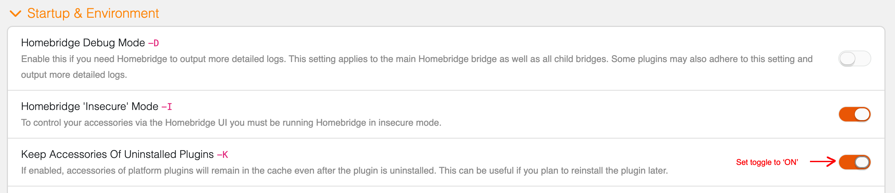
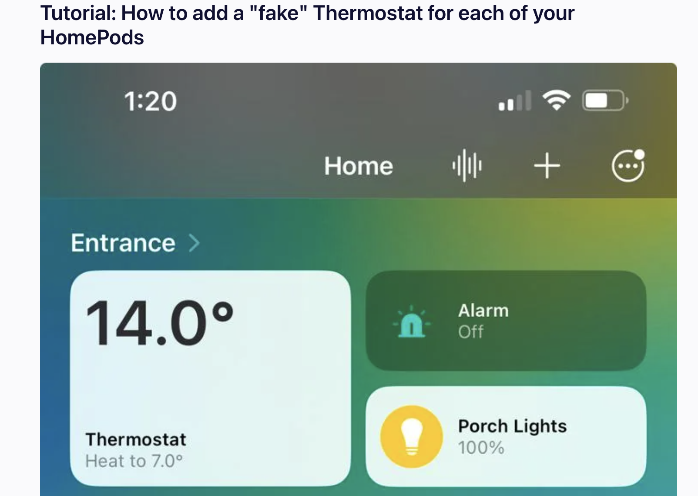

<div>
    <a href="https://www.npmjs.com/package/homebridge-virtual-accessories"></a>
    <a href="https://www.npmjs.com/package/homebridge-virtual-accessories"></a>
    <a href="https://github.com/homebridge/homebridge/wiki/Verified-Plugins"></a>
    <a href="https://github.com/justjam2013/homebridge-virtual-accessories"></a>
    <a href="https://discord.gg/Z8jmyvb"></a>
</div>

<br/><br/>
<p align="center" vertical-align="middle">
    <a href="https://github.com/justjam2013/homebridge-virtual-accessories"></a>
    <a href="https://github.com/homebridge/homebridge"></a>
</p>

<span align="center">

# Virtual Accessories For Homebridge

</span>

### Virtual Accessories For Homebridge is a plugin for Homebridge that provides the ability to create virtual HomeKit accessories.

## <!-- Thin separator line -->

> [!CAUTION]
> **The upcoming Virtual Accessories For Homebridge v3.0.0 will be a breaking upgrade.** To get a preview of the coming changes, please read the [wiki page](https://github.com/justjam2013/homebridge-virtual-accessories/wiki/Virtual-Accessories-For-Homebridge-v3.0.0-breaking-update). You do not have to do anything right now. When v3.0.0 is released this documantion will be updated.

> [!WARNING]
> **Virtual Accessories For Homebridge v2.0.0 is a breaking upgrade.** If you are upgrading from a previous version, please read the [wiki page](https://github.com/justjam2013/homebridge-virtual-accessories/wiki/Virtual-Accessories-For-Homebridge-v2.0.0-breaking-update) for details on how to update your configuration.

## <!-- Thin separator line -->

<details>
  <summary>
    
  ## 📝 Table Of Contents

  </summary>

  - [About Virtual Accessories For Homebridge](#about-virtual-accessories-for-homebridge)
  - [Installation](#installation)
    - [Docker](#docker)
    - [MacOS](#macos)
    - [Synology](#synology)
  - [Configuration](#configuration)
  - [Reference JSON Configurations](#reference-json-configurations)
    - [Doorbell](#doorbell)
    - [Fan](#fan)
    - [Garage Door](#garage-door)
    - [Humidifier/Dehumidifier](#humidifierdehumidifier)
    - [Lightbulb](#lightbulb)
    - [Lock](#lock)
    - [Security System](#security-system)
    - [Valve](#valve)
    - [Window Covering - Blinds, Shades](#window-covering---blinds-shades)
    - [Switch](#switch)
    - [Switch with reset timer](#switch-with-reset-timer)
    - [Switch with random reset timer](#switch-with-random-reset-timer)
    - [Switch with companion sensor (sensor triggered on \& off by switch state)](#switch-with-companion-sensor-sensor-triggered-on--off-by-switch-state)
    - [Sensor with ping trigger](#sensor-with-ping-trigger)
    - [Sensor with cron trigger](#sensor-with-cron-trigger)
    - [Sensor with cron trigger with start and end datetimes](#sensor-with-cron-trigger-with-start-and-end-datetimes)
    - [Sensor with sun events trigger](#sensor-with-sun-events-trigger)
  - [Creative Uses](#creative-uses)
  - [Known Issues](#known-issues)
  - [What if I run into a problem?](#what-if-i-run-into-a-problem)
</details>

## <!-- Thin separator line -->

## About Virtual Accessories For Homebridge

This plugin is inspired by Nick Farina's most excellent 🎸 [homebridge-dummy](https://github.com/nfarina/homebridge-dummy) plugin, which formed the backbone of my HomeKit automations. This plugin is Homebridge Verified and is ready for Homebridge 2.0.

The purpose of this plugin is to provide a single solution for creating different types of virtual HomeKit accessories. In my automations it has replaced seven separate plugins, each of which provided part of the functionality I needed, and all of which had gone unmaintained or abandoned. Also, it became frustrating trying to figure out which plugin provided what functionality or managed which accessory, each time I wanted to make a change.

The downside to a single plugin is trading ease of accessory maintenance for a single point of failure. However, this is work in progress so I will be publishing bug fixes and improvements. Also, I will slowly add new accessories and functionality, either as I need them, or, more likely, in response to requests by users who find this plugin useful.

Currently, these are the implemented virtual accessories:

-   **Doorbell.** Allows you to use a button as a doorbell and have it play a chime on Home Pods.
-   **Fan.** Allows you to create a virtual fan and set rotation direction and speed.
-   **Garage Door.** Allows you to create a virtual garage door. Generates a HomeKit notification when the accessory's state changes. Also, CarPlay will display a widget when you approach your home.
-   **Humidifier/Dehumidifier.** Allows you to create a virtual humidifier/dehumidifier. You can select humidifier only, dehumidifier only, or humidifier + dehumidifier combo.
-   **Lightbulb.** Allows you to create virtual white lightbulbs (on/off and brightness). In the Home app, this can be used as a dimmer switch.
-   **Lock.** Allows you to create a vidtual lock. Generates a HomeKit notification when the accessory's state changes. It also creates a (non-functional) Home Key card in the Wallet app.
-   **Security System.** Allows you to create a virtual security system.
-   **Valve.** Allows you to create different types of virtual valves: generic, irrigation, shower head, or water faucet.
-   **Window Covering.** Allows you to create virtual blinds and shades.
-   **Switch.** Allows you to create a number of different types of virtual switches.
    - **Plain old switches.** What it says on the label.
    - **Normally on/off switches.** The default state of the switch can be set to "on" or "off". This is also the default state when Homebridge restarts. If you pair it with a timer, the switch will revert back to the default state when the timer expires.
    - **Stateful switches.** The state of the switch persists across restarts of Homebridge. Currently a switch can only be stateful or timed, but not both.
    - **Timed switches.** The switch will revert back to its default state when the timer expires. This is a way to introduce timers into HomeKit. Currently a switch can only be stateful or timed, but not both.
    - **Switches with companion sensors.** The switch will trigger a companion sensor when it changes state, generating a HomeKit-native notification in the Home app. Selecting a critical sensor type will allow notifications to bypass Focuses like "Do Not Disturb". This is just the easier way of implementing a switch triggered sensor.
    - **Dimmer switches.** To create a dimmer switch use a virtual lightbulb.
-   **Sensor.** Allows you to create different types of virtual sensors. If Activity Notifications are enabled in the Home app, sensors will generate notifications when their state changes in response to a detected event. Some types of notifications, classified as `critical` by Homekit, are allowed to bypass Focuses like `Do Not Disturb` and some are allowed to appear in CarPlay. Sensors can be activated by different triggers. Currently, the available triggers are:
    - **Host Ping trigger.** Actvates the sensor after a configurable number of failed attempts to ping a network host. The sensor resets when ping is successful.
    - **Cron trigger.** Activates the sensor when the time and date match the schedule deascribed by a cron expression. The sensor resets after a brief delay.
    - **Sun Events trigger.** Activates the sensor when the selected event happens: sunrise, sunset, and golden hour (for the photographers among us). The sensor resets after a brief delay.
    - **Switch trigger.** To create a switch triggered sensor, create a virtual switch accessory with a companion sensor. This is just the easier way of implementing a switch triggered sensor. A future version may provide the ability to create this pairing as a sensor with a switch trigger.

## Installation

You can install this plugin via the Homebridge UI or from the command line, by typing:

```
npm install -g homebridge-virtual-accessories
```

> [!IMPORTANT]
> Virtual Accessories For Homebridge has dependencies on platform-native libraries, which get compiled for that particular platform at install time. Therefore you will need to make sure that the platform you are installing this plugin on has the necessary build tools available. The official Homebridge Docker image and the Homebridge Linux (apt) install, both provide all the necessary tools. If you are choosing to install on other platforms, you will require the appropriate technical skills to do the necessary installs. I have neither the capacity nor the hardware to test installs on every platform that Homebridge runs on. Below are platform specific installation notes, which I will update as users of this plugin report issues.

> [!IMPORTANT]
> If you manually update the Node.js version that Homebridge is running on, you will need to ensure that the platform-native library `raw-socket` will also be updated. Run the following commands immediately after the Node.js update:
> ```
> npm uninstall raw-socket
> npm install raw-socket
> ```

> [!CAUTION]
> Due to Virtual Accessories For Homebridge using platform-native modules, when updating Node.js, if the `raw-socket` module is also not updated (see above), it may cause the plugin to fail to load and Homebridge to delete all of the plugin's accessories. It is therefore **strongly** recommended to toggle the `Keep Accessories Of Uninstalled Plugins` option to on, at least while performing updates. This setting is in the `Settings` screen, `Startup & Environment` section:
> 
> 

### Docker
If you are installing Virtual Accessories For Homebridge in the Homebridge Docker image, you will need to add the following lines to `config/startup.sh`:
```
npm uninstall raw-socket
npm install raw-socket
```
This will ensure that if the version of Node.js is updated in the Docker image, the platform-native library `raw-socket` will also be updated after the container starts up.

### MacOS
If you are installing Virtual Accessories For Homebridge in a Homebridge instance running on macOS, you will need to ensure that Xcode or the Xcode Command Line Tools are installed. To install Xcode or the Xcode Command Line Tools, use the following command:
```
xcode-select --install
```

### Synology
If you are installing Virtual Accessories For Homebridge in a Homebridge instance running on Synology DSM, you will need to ensure that a build toolchain is installed.

This document provides steps for installing the Entware toolchain and other needed packages: [DSM 7: Enable Compiling Of Native Modules](https://github.com/homebridge/homebridge-syno-spk/wiki/DSM-7:-Enable-Compiling-Of-Native-Modules).

The [Synology DSM 7.2.2 Developer Guide](https://help.synology.com/developer-guide/getting_started/system_requirement.html) provides information to setup the build tools for Synology DSM platforms.

## Configuration

You can configure the plugin from the Homebridge UI, or by ediiting the JSON configuration directly in the Homebridge JSON Config editor.
In the UI, required fields will be marked with an asterisk (*) and you will not be allowed to save the configuration if the required fields are not filled in.

`accessoryID`, `accessoryName`, and `accessoryType` are required fields for all the accessories.

The configuration is validated on startup, so if an accessory is misconfigured, you will see error entries in the logs to help you to correct the configuration. The log entries will indicate the misconfigured fields and look something like this:
```
[12/21/2024, 12:35:38 AM] [Virtual Accessories Platform] Skipping accessory. Configuration is invalid: { "accessoryID": "12345", "accessoryName": "My Switch", ... }
[12/21/2024, 12:35:38 AM] [Virtual Accessories Platform] Invalid fields: [switchDefaultState]
```

> [!IMPORTANT]
> `accessoryID` uniquely identifies an accessory and each accessory must have a different value. This is because HomeKit requires a unique and unmodifiable serial number to identify an accessory. The accessory ID acts as a virtual serial number for each accessory that must be unique and unmodifiable. If you do assign the same accessory ID to multiple accessories by mistake, on startup the plugin will skip any accessory that has a duplicate ID and output a message in the logs alerting you to the issue. If you change the value of `accessoryID` after saving the config, HomeKit will interpret the change as the "old" accessory having been deleted and a "new" one added. This will cause the Home app to delete any scenes and automations that use the deleted accessory. Some plugins use the accessory name as the unique ID, which means that you cannot easily change the name. Virtual Accessories For Homebridge uses a dedicated field as the unique ID, allowing you to modify the accessory name, if you so choose to.<p>
I use [random.org](https://www.random.org/) to generate unique IDs. While the plugin only requires 5 digits for the IDs, I use 7-digit values between 1,000,000 and 10,000,000. This provides a range of 9 million possible IDs, which greatly reduces the chances of a duplicate.

> [!NOTE]
> `acccessoryName` is the name that will apppear on the Homekit tile for the accessory, as well as the accessory header in the plugin config. While a unique name is not required, it is recommended to assign different names to each accessory. As Vitual Accessories For Homebridge uses `accessoryID` as the unique identifier, **you can change the accessory name at any time**, if you so choose to. The name change will be propagated to the Home app.

## Reference JSON Configurations

If you choose to manually create or modify the accessory JSON configurations, the following are references. Please adjust for your requirements.

### Doorbell

```json
{
    "name": "Virtual Accessories Platform",
    "devices": [
        {
            "accessoryID": "1234567",
            "accessoryName": "My Doorbell",
            "accessoryType": "doorbell",
            "doorbell": {
                "volume": 100
            }
        }
    ],
    "platform": "VirtualAccessoriesForHomebridge"
}
```
### Fan

```json
{
    "name": "Virtual Accessories Platform",
    "devices": [
        {
            "accessoryID": "1234567",
            "accessoryName": "My Fan",
            "accessoryType": "fan",
            "fan": {
                "defaultState": "off",
                "rotationDirection": "clockwise",
                "rotationSpeed": 80
            }
        }
    ],
    "platform": "VirtualAccessoriesForHomebridge"
}
```

### Garage Door

```json
{
    "name": "Virtual Accessories Platform",
    "devices": [
        {
            "accessoryID": "1234567",
            "accessoryName": "My Garage Door",
            "accessoryType": "garagedoor",
            "accessoryIsStateful": false,
            "garageDoor": {
                "defaultState": "closed",
                "transitionDuration": 7
            }
        }
    ],
    "platform": "VirtualAccessoriesForHomebridge"
}
```

### Humidifier/Dehumidifier

```json
    "name": "Virtual Accessories Platform",
    "devices": [
        {
            "accessoryID": "1234567",
            "accessoryName": "My Humidifier",
            "accessoryType": "humidifierdehumidifier",
            "humidifierDehumidifier": {
                "type": "humidifier",
                "humidifierThreshold": 50
            }
        }
    ],
    "platform": "VirtualAccessoriesForHomebridge"
```

### Lightbulb

```json
    "name": "Virtual Accessories Platform",
    "devices": [
        {
            "accessoryID": "1234567",
            "accessoryName": "My Lightbulb",
            "accessoryType": "lightbulb",
            "lightbulb": {
                "defaultState": "off",
                "brightness": 100,
                "type": "white"
            }
        }
    ],
    "platform": "VirtualAccessoriesForHomebridge"
```

### Lock

```json
{
    "name": "Virtual Accessories Platform",
    "devices": [
        {
            "accessoryID": "1234567",
            "accessoryName": "My Lock",
            "accessoryType": "lock",
            "accessoryIsStateful": false,
            "lock": {
                "defaultState": "locked",
                "hardwareFinish": "silver",
                "hasAudioFeedback": false,
                "autoSecurityTimeout": 5
            }
        }
    ],
    "platform": "VirtualAccessoriesForHomebridge"
}
```
`lockHardwareFinish` sets the color of the HomeKey card in the Wallet app.

### Security System

```json
    "name": "Virtual Accessories Platform",
    "devices": [
        {
            "accessoryID": "1234567",
            "accessoryName": "My Security System",
            "accessoryType": "securitysystem",
            "securitySystem": {
                "defaultState": "disarmed"
            }
        }
    ],
    "platform": "VirtualAccessoriesForHomebridge"
```

### Valve

```json
{
    "name": "Virtual Accessories Platform",
    "devices": [
        {
            "accessoryID": "1234567",
            "accessoryName": "My Valve",
            "accessoryType": "valve",
            "valve": {
                "type": "waterfaucet",
                "duration": 0
            }
        }
    ],
    "platform": "VirtualAccessoriesForHomebridge"
}
```

### Window Covering - Blinds, Shades

```json
{
    "name": "Virtual Accessories Platform",
    "devices": [
        {
            "accessoryID": "1234567",
            "accessoryName": "My Blinds",
            "accessoryType": "windowcovering",
            "accessoryIsStateful": false,
            "windowCovering": {
                "defaultState": "closed",
                "transitionDuration": 3
            }
        }
    ],
    "platform": "VirtualAccessoriesForHomebridge"
}
```

### Switch

```json
{
    "name": "Virtual Accessories Platform",
    "devices": [
        {
            "accessoryID": "1234567",
            "accessoryName": "My Switch",
            "accessoryType": "switch",
            "accessoryIsStateful": false,
            "switch": {
                "defaultState": "off",
                "muteLogging": false
            }
        }
    ],
    "platform": "VirtualAccessoriesForHomebridge"
}
```

### Switch with reset timer

```json
{
    "name": "Virtual Accessories Platform",
    "devices": [
        {
            "accessoryID": "1234567",
            "accessoryName": "My Switch",
            "accessoryType": "switch",
            "accessoryIsStateful": false,
            "switch": {
                "defaultState": "off",
                "hasResetTimer": true
            },
            "resetTimer": {
                "duration": 10,
                "units": "seconds",
                "isResettable": true
            }
        }
    ],
    "platform": "VirtualAccessoriesForHomebridge"
}
```

### Switch with random reset timer

```json
{
    "name": "Virtual Accessories Platform",
    "devices": [
        {
            "accessoryID": "1234567",
            "accessoryName": "My Switch",
            "accessoryType": "switch",
            "accessoryIsStateful": false,
            "switch": {
                "defaultState": "off",
                "hasResetTimer": true
            },
            "resetTimer": {
                "durationIsRandom": true,
                "durationRandomMin": 5,
                "durationRandomMax": 20,
                "units": "seconds",
                "isResettable": true
            }
        }
    ],
    "platform": "VirtualAccessoriesForHomebridge"
}
```

### Switch with companion sensor (sensor triggered on & off by switch state)

```json
{
    "name": "Virtual Accessories Platform",
    "devices": [
        {
            "accessoryID": "1234567",
            "accessoryName": "My Switch",
            "accessoryType": "switch",
            "accessoryIsStateful": false,
            "switch": {
                "defaultState": "off",
                "hasCompanionSensor": true
            },
            "companionSensor": {
                "name": "My Companion Sensor",
                "type": "contact"
            }
        }
    ],
    "platform": "VirtualAccessoriesForHomebridge"
}
```

### Sensor with ping trigger

```json
{
    "name": "Virtual Accessories Platform",
    "devices": [
        {
            "accessoryID": "1234567",
            "accessoryName": "My Ping Sensor",
            "accessoryType": "sensor",
            "sensor": {
                "type": "contact",
                "trigger": "ping"
            },
            "pingTrigger": {
                "host": "192.168.0.200",
                "failureRetryCount": 3,
                "isDisabled": false
            }
        }
    ],
    "platform": "VirtualAccessoriesForHomebridge"
}
```

### Sensor with cron trigger

```json
{
    "name": "Virtual Accessories Platform",
    "devices": [
        {
            "accessoryID": "1234567",
            "accessoryName": "My Cron Sensor",
            "accessoryType": "sensor",
            "sensor": {
                "type": "contact",
                "trigger": "cron"
            },
            "cronTrigger": {
                "pattern": "* * * * * *",
                "zoneId": "America/Los_Angeles",
                "disableTriggerEventLogging": false,
                "isDisabled": false
            }
        }
    ],
    "platform": "VirtualAccessoriesForHomebridge"
}
```

### Sensor with cron trigger with start and end datetimes

```json
{
    "name": "Virtual Accessories Platform",
    "devices": [
        {
            "accessoryID": "1234567",
            "accessoryName": "My Cron Sensor",
            "accessoryType": "sensor",
            "sensor": {
                "type": "contact",
                "trigger": "cron"
            },
            "cronTrigger": {
                "pattern": "* * * * * *",
                "zoneId": "America/Los_Angeles",
                "startDateTime": "2024-11-14T19:41:00",
                "endDateTime": "2024-11-30T19:41:00",
                "disableTriggerEventLogging": false,
                "isDisabled": false
            }
        }
    ],
    "platform": "VirtualAccessoriesForHomebridge"
}
```
Note: A datetime field might omit the seconds, if the value is `00`, so, either of the following are valid and equivalent per ISO standard:
```
"startDateTime": "2024-11-14T19:41:00",
"startDateTime": "2024-11-14T19:41",
```

### Sensor with sun events trigger

```json
{
    "name": "Virtual Accessories Platform",
    "devices": [
        {
            "accessoryID": "1234567",
            "accessoryName": "My Sunrise trigger",
            "accessoryType": "sensor",
            "sensor": {
                "type": "contact",
                "trigger": "sunevents"
            },
            "sunEventsTrigger": {
                "event": "sunrise",
                "latitude": "37.226148",
                "longitude": "-115.837523",
                "zoneId": "America/Los_Angeles",
                "isDisabled": false
            }
        }
    ],
    "platform": "VirtualAccessoriesForHomebridge"
}
```

> [!NOTE]
> Due to limitations in the current version of one of Homebridge UI's dependencies, the Homebridge UI may save additional fields to the JSON config that may not be relevant to a particular accessory. The JSON config for each individual accessory is validated on startup and extranous fields are ignored. In a future release, the startup validation may perform a config cleanup. However. this does not affect the behavior of the accessories, nor does it hurt to manually remove those fields from the JSON config.

## Creative Uses

I started this plugin as a Homebridge 2.0 ready plugin to replace [homebridge-dummy](https://github.com/nfarina/homebridge-dummy), which, along with six other plugins, formed the backbone of my HomeKit automations. Then I got some really odd requests, like a window covering. Okay ... what the heck are you going to do with a virtual window covering?? Well, the user who requested it wanted to use "Siri open/close .." to control their trash bin, as opposed to "Siri on/off .." as would be required with switches. Yup, "I use [your plugin] for my trash" is what every plugin developer loves to hear! 🤣 <br/>

So here are creative ways people have used this plugin. Maybe they might inspire others.

#

<figure>
    <figcaption>:bulb: Tutorial: How to add a "fake" Thermostat for each of your HomePods</figcaption>
    <p></p>
    <a href="https://www.reddit.com/r/homebridge/comments/1i3xk9w/tutorial_how_to_add_a_fake_thermostat_for_each_of/"">
        
    </a>
</figure>

#

## Known Issues

-   The Humidifier/Dehumidifier accessory is not properly rendered in Homebridge UI. Homebrige UI currently is unable to differentiate between Humidifier-only, Dehumidifier-only, and Humidifier-Dehumidifier accessories, but HomeKit renders it correctly.
-   The ability to order the accessories has been rolled back, as it makes it impossible to drag a number slider, for example to set the Doorbell volume between 0%-100%. A bug report has been opened. Once the bug is fixed, this functionality will be restored. The temporary workaround is to manually edit the order of the accessories in the JSON configuration.

## What if I run into a problem?

If you encounter a problem, you can [check the #virtual accessories channel on Discord](https://discord.gg/Z8jmyvb) for any notifications, or [open an issue on GitHub](https://github.com/justjam2013/homebridge-virtual-accessories/issues/new/choose). Please attach any log output to the issue, making sure to remove any sensitive information such as passwords, tokens, etc.

Please open a [Feature Request issue](https://github.com/justjam2013/homebridge-virtual-accessories/issues/new/choose) if you have any enhancement suggestions or any additional functionality that you would like to see added, or comment on an existing issue if one is already open.
